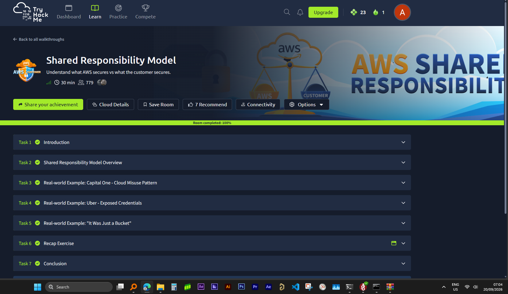

# AWS Cloud Security Assessment

[](https://aws.amazon.com/security/)
[](https://aws.amazon.com/iam/)
[](https://aws.amazon.com/s3/)
[](https://tryhackme.com/)

A professional cloud security assessment documenting IAM enumeration and S3 misconfiguration findings across authorised training labs — Pwned Labs, flaws.cloud, and TryHackMe. Both findings sit on the **customer side of the AWS Shared Responsibility Model**, reinforcing that platform security does not prevent misconfiguration.

> **Core principle:** in both cases AWS behaved correctly — the exposures came entirely from customer-controlled identity permissions and bucket configuration.

## Final Report

📄 **[Read the complete Cloud Security Assessment Report](AbdullahZubair_Week6_CloudSecurity_Report.pdf)**

- **Student ID:** AQT-1203
- **Assessment type:** Authorised training-lab assessment (Pwned Labs, flaws.cloud, TryHackMe)
- **Report date:** 20 September 2026
- **Prepared by:** Abdullah Zubair

## Project Objectives

1. Complete Pwned Labs — Intro to AWS IAM Enumeration lab.
2. Complete flaws.cloud Level 1 — storage and cloud-risk lab.
3. Complete TryHackMe — AWS Shared Responsibility Model room (100%).
4. Document all findings with evidence, risk ratings, and actionable remediation.
5. Produce a professional cloud security assessment report.

## Scope and Environment

| Lab | Platform | Focus |
|---|---|---|
| Intro to AWS IAM Enumeration | Pwned Labs | IAM identity and permissions enumeration |
| flaws.cloud Level 1 | flaws.cloud | S3 public access misconfiguration |
| AWS Shared Responsibility Model | TryHackMe | Cloud security concepts (100% completion) |

## Findings

| ID | Title | Severity |
|---|---|---|
| CLOUD-01 | Over-permissioned IAM user with exposed long-lived keys — internal S3 bucket read | 🟠 High |
| CLOUD-02 | Publicly listable S3 bucket exposing hidden object | 🟡 Medium |

Both findings required zero exploitation — only enumeration using standard AWS CLI commands. Leaked long-lived keys and public bucket policies are continuously targeted by automated scanners.

## Methodology

1. **Pre-engagement** — Confirmed authorised scope and lab objectives
2. **Identity enumeration** — `aws sts get-caller-identity`, `aws iam list-*` commands against dev01
3. **Resource enumeration** — `aws s3 ls` and `--no-sign-request` for anonymous bucket listing
4. **Access validation** — Retrieved accessible objects to confirm impact
5. **Reporting** — Risk-rated findings with evidence and remediation mapped to AWS Shared Responsibility Model

## Screenshots




## Recommendations

- Apply least privilege to every IAM identity; scope to only required actions and resources
- Replace long-lived access keys with short-lived role-based credentials (`sts:AssumeRole`) and SSO
- Enable S3 Block Public Access at account and bucket level; remove AllUsers/AuthenticatedUsers grants
- Never rely on unguessable object names for confidentiality — enforce access policies
- Require MFA on all IAM users; use permission boundaries or SCPs to cap identity permissions
- Enable CloudTrail, GuardDuty, and IAM Access Analyzer to detect anomalous enumeration and credential misuse

## Repository Structure

```text
.
├── README.md
├── AbdullahZubair_Week6_CloudSecurity_Report.pdf
└── screenshots/
```

## Limitations

- All activity was performed exclusively within Pwned Labs, flaws.cloud, and TryHackMe authorised training environments.
- Findings reflect intentionally vulnerable lab configurations and should not be generalised to production AWS environments.
- Risk ratings reflect analyst judgment against the specific lab context tested.
- Only two practical findings were produced; the TryHackMe room was conceptual and produced no technical findings.

## Lessons Learned

- IAM misconfiguration and S3 public access are the two most common AWS attack surfaces — for good reason.
- Leaked long-lived access keys require no exploit; standard AWS CLI commands are sufficient to enumerate permissions and access data.
- The Shared Responsibility Model is not a defence — AWS secures the platform, but customer-side configuration choices determine real-world exposure.
- Anonymous S3 access is trivially exploitable; automated scanners continuously probe for publicly listable buckets.
- Finding a vulnerability is only half the work — expressing it with accurate evidence and actionable remediation is what makes it useful.

## Author

**Abdullah Zubair**  
- GitHub: [@AvatarParzival](https://github.com/AvatarParzival)
- LinkedIn: [Abdullah Zubair](https://www.linkedin.com/in/abdullahzubairr)
- Email: [abdullah69zubair@gmail.com](abdullah69zubair@gmail.com)

## Responsible Use

This repository is intended for educational, defensive-security and professional portfolio purposes. All testing was performed within authorised training environments. Do not reproduce these techniques against AWS accounts or resources without explicit written authorisation.
